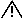

#Crowbar User Guide 
##Version 1.5

Revised 2/25/2013

For the most recent versions consult the [Crowbar Wiki ](http://github.com/dellcloudedge/crowbar/wiki "Wiki").

>THIS DOCUMENT IS PROVIDED UNDER AN APACHE 2 LICENSE
##Notes, Cautions, and Warnings

>  A NOTE indicates important information that helps you make better use of your system.

>  A CAUTION indicates potential damage to hardware or loss of data if instructions are not followed.

>  A WARNING indicates a potential for property damage, personal injury, or death.

Information in this document is subject to change without notice. 

© 2011-2013 Dell Inc. All rights reserved.

Reproduction of these materials is allowed under the Apache 2 license.

Dell, the DELL logo, and the DELL badge, PowerConnect, and PowerEdge are trademarks of Dell Inc. Cloudera, CDH, and Cloudera Enterprise are trademarks of Cloudera and its affiliates in the US and other countries. Intel® and Xeon® are registered trademarks of Intel Corporation in the U.S. and other countries. Other trademarks used in this text: Nagios®, Opscode Chef™, OpenStack™, Canonical Ubuntu™, and VMware™.

Dell Precision™, OptiPlex™, Latitude™, PowerEdge™, PowerVault™, PowerConnect™, OpenManage™, EqualLogic™, KACE™, FlexAddress™ and Vostro™ are trademarks of Dell Inc. Intel®, Pentium®, Xeon®, Core™ and Celeron® are registered trademarks of Intel Corporation in the U.S. and other countries. AMD® is a registered trademark and AMD Opteron™, AMD Phenom™, and AMD Sempron™ are trademarks of Advanced Micro Devices, Inc. Microsoft®, Windows®, Windows Server®, MS-DOS® and Windows Vista® are either trademarks or registered trademarks of Microsoft Corporation in the United States and/or other countries.

Red Hat Enterprise Linux® and Enterprise Linux® are registered trademarks of Red Hat, Inc. in the United States and/or other countries. Novell® is a registered trademark and SUSE ™ is a trademark of Novell Inc. in the United States and other countries. Oracle® is a registered trademark of Oracle Corporation and/or its affiliates. Citrix®, Xen®, XenServer® and XenMotion® are either registered trademarks or trademarks of Citrix Systems, Inc. in the United States and/or other countries. VMware®, Virtual SMP®, vMotion®, vCenter®, and vSphere® are registered trademarks or trademarks of VMware, Inc. in the United States or other countries.

Other trademarks and trade names may be used in this publication to refer to either the entities claiming the marks and names or their products. Dell Inc. disclaims any proprietary interest in trademarks and trade names other than its own.