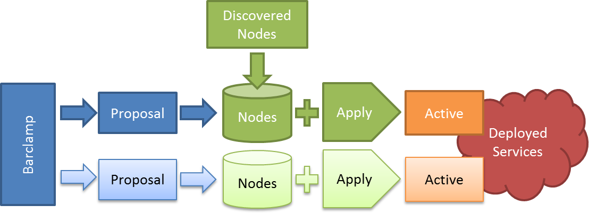
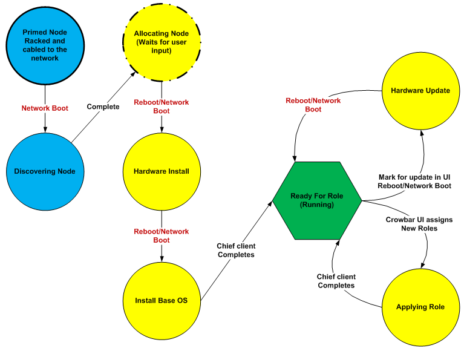

#Crowbar Operation#
##Barclamp Life Cycle##
Understanding the barclamp life cycle is essential to understanding the Crowbar user interface layout.
######Barclamp Life Cycle#######

Crowbar progresses all deployments through a fixed lifecycle. It is important to understand this life cycle to use Crowbar.

The figure above shows the life cycle of a barclamp within Crowbar. A barclamp defines the capability for a service but cannot be deployed. To deploy a barclamp, you must create a proposal. Once the proposal is created, you must select one or more nodes that will fulfill the roles provided by the barclamp. As discussed in the next sections, you may also edit the proposal’s attributes as needed.
 
Applying the proposal tells Crowbar to deploy the proposal onto the nodes. Nodes return to the Ready state when deployment is completed. At this point, the proposal is considered active.
Once a proposal has become active, you may still edit it and reapply the changes. Crowbar will adjust the deployed proposal.

Removing nodes will change the configuration for nodes remaining in the proposal; however, it does not perform cleanup actions on the removed node. You may also “deactivate” an applied proposal. This will remove the nodes from the proposal but keeps the configuration data.

If you delete an inactive proposal then your configuration changes will be lost.
> Many barclamps require multiple nodes before they can be deployed. A proposal is not deployed until it has a sufficient number of nodes.

At the time a proposal is applied, Crowbar updates the “Run List” of the Crowbar managed node role in Chef. The following table shows options for changes to proposals based on their current state.

######Changes to Proposals Based on Their Current State######

----------

| State | Icon | Forwards | Backwards | Comment |
| :--- | :--- | :------- | :-------- | :------ |
| No Proposal |  | Create | None | You must create proposal |
| User Input |  | Apply | Delete |
| Active |  | Apply	| Deactivate | You may reapply without deactivating a proposal. |
| Pending |  (blinking) | None: Proposal Queued	| Dequeue | Crowbar is building nodes during this phase. |
| In Progress |  (spinning) | None: System Working | None: System Working |
| Failed |  (blinking) | Apply (after fixing issue) | Delete | In some cases, reapplying the proposal is sufficient to fix. |

----------

##Crowbar State Machine##
When Crowbar brings systems up, the systems run through a series of states, each of which performs different actions on the systems. This is controlled by the Provisioner barclamp, and the status of any of the systems is indicated by the icon next to the system on the Dashboard page. You can see a description of the state a system is in by hovering over the status icon.
 
######The States a System Progresses through to Fully Provision a System Discovering Node ######

###Discovering Node###
During the Discovering Node state, the node network boots a CentOS LiveCD image to make sure that the node can run some basic components. Once this is complete, the LiveCD image registers with the Admin node to declare its state. The admin node adds the machine to the Chef database, and allocates a BMC and Admin network address for the node. After discovery, no persistent changes have been made to the node or its configuration. The node must be allocated before any permanent changes are made.
###Allocating Node###
By default the nodes pause after the discovered state. The node awaits allocation either manually through the API (CLI or UI) or by being included in a proposal that is committed to the system. Since the node is not in the ready state, the proposal is queued until the newly allocated node is ready. During the allocation process, Crowbar examines what roles will be applied to the node and uses this information to influence the configuration of the BIOS and RAID systems. 
###Hardware Install###
The LiveCD image reboots forcing another network boot. During the Hardware Install state, the node network boots a CentOS LiveCD image to make sure that the BIOS/BMC/RAID controller are up-to-date. The CentOS LiveCD also updates the BIOS and RAID configurations. Once this is complete, the LiveCD image registers with the Admin node to declare its state. The Admin node updates the Chef database and resets the DHCP entry to installation state. 
###Base OS Install###
The LiveCD image reboots forcing another network boot. The node boots into a network installation of Ubuntu or Red Hat. The installation process reboots the node. Upon reboot and completing the one-time setup script, the system transitions to the Ready for Role state. The first time the Chef client is run, the node gets a base set of configuration (Nagios® client, Ganglia client, NTP client, DNS resolver). Reinstall will reinstall the base OS on the node, as well as redeploying the roles applied to the node. This effectively uninstalls any custom software that was installed on it and removes all custom configuration that was done to it.
###Ready for Role###
This is the state that a node spends most of its time in. The node runs the Chef client periodically to ensure that it is up-to-date. It waits for changes to its configuration. If the node reboots, then the node network boots the local boot image again and returns to this state. 
###Hardware Update###
To transition to this state, mark the node as needing hardware updates in the Crowbar UI and then reboot the node. The node network boots and does the same actions as the Hardware Install state, except that it makes no changes to the RAID configuration. Once this is complete, the LiveCD image registers with the Admin node to declare its state. The Admin node updates the Chef database and resets the DHCP entry to installation state. The return state is back to the Ready for Role state. This state allows for the update of the BIOS on a provisioned node without making any other changes to the server. 
###Applying Role###
This is a transient state that represents the running Chef client. It is the time that the node is applying a new configuration before returning to Ready for Role. The transition to this state happens periodically or can be forced by the Admin node. 