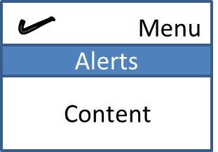
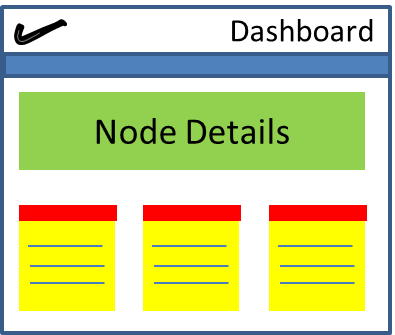
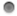
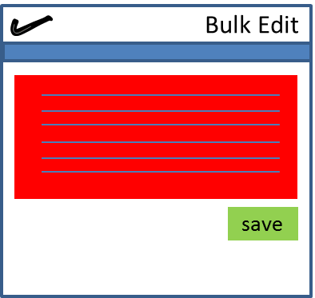
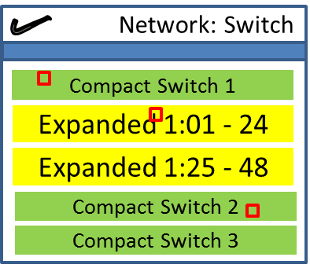
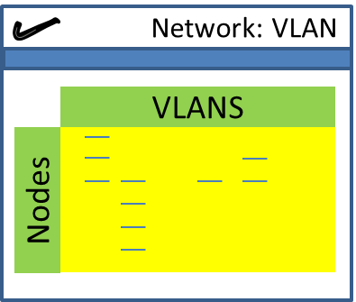
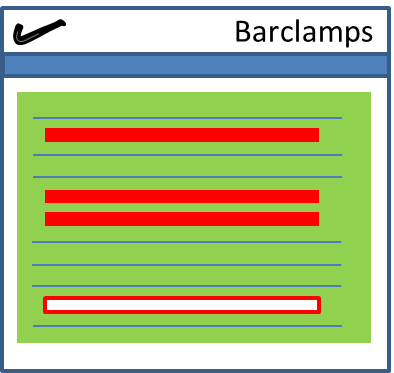
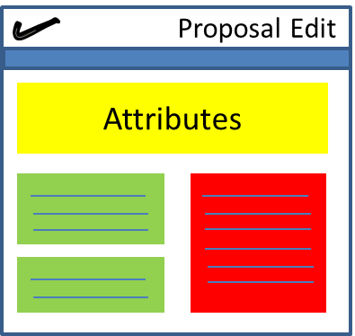

#Using the Crowbar Web Interface#
User Interface / Using Crowbar
Crowbar is delivered as a web application available on the Admin node using HTTP on port 3000. By default, you can access it using http://192.168.124.10:3000 (see table below). The Crowbar dashboard includes links to the other tools installed, including Ganglia, Nagios®, and Chef.

######Service URLs######

----------

| Service |	URL	| Credentials |
| :----- | :-- | :---------- |
| SSH | root@192.168.124.10 | crowbar |
| Crowbar UI | http://192.168.124.10:3000 | crowbar / crowbar |
| Nagios® UI | http://192.168.124.10/nagios3 | nagiosadmin / password |
| Ganglia UI | http://192.168.124.10/ganglia | nagiosadmin / password |
| Chef UI | http://192.168.124.10:4040 | admin / password |

----------

> Dell supports running Crowbar on the following browsers: Firefox 3.6, Firefox 11, Google Chrome, Internet Explorer 8, and Internet Explorer 9. HTML5 compatibility and a minimum screen resolution of 1024 x 768 are recommended.

The IP address 192.168.124.10 is the default address. Replace it with the address assigned to the Admin node.
The Crowbar interface has two primary concepts: nodes and barclamps. All actions are focused on management of these two elements. Before discussing the UI, it’s important to understand how they are used by Crowbar. 
##Nodes##
Nodes represent distinct servers in your environment. A server is a single operating system with multiple NICs and HDDs. Each server is identified uniquely by the MAC address of the NIC on the administrative network.
> Crowbar nodes map directly to Chef nodes. In fact, all data used in Crowbar is stored entirely in Chef. Chef is the database for Crowbar. Changing a node’s data in Chef changes it in Crowbar.

##Barclamps##
- Barclamps represent modular capabilities that you can install onto none, some, or all of the nodes in your environment. 
- Barclamps are activated by generating a proposal for that Barclamp. It is possible to generate multiple proposals for some barclamps, while others may only have a single instance.
- Once a proposal is reviewed, you must activate it before it becomes active in the system.

> Barclamps are decomposed in Chef as multiple components: Crowbar data bag entries, cookbooks, recipes, and roles. Our objective is to allow the Chef components used by barclamps to operate in Chef even without Crowbar.

Barclamps have a specific life cycle that is discussed below in more detail as we explore the user interface. Information about using, creating, and extending barclamps is included in the Supplemental Material section.
##General Layout ##
The menu for Crowbar is displayed on the upper right side of the page. Clicking on one of the menu sections causes related content to display on the lower section of the screen.
######General Layout######

Alerts or confirmation messages may be displayed between the menu and the page content. Most Crowbar screens automatically update state information so you should not have to refresh the page to get the most current information.

##Nodes (System Dashboard)##
The Dashboard shows all the nodes in the system and lets you manipulate their power and configuration states.
######Dashboard######

###Node Alias and Description###
Users can override the default MAC addressed-based names in the UI from the Node edit page or Bulk Edit pages. When set, the entire UI will display the Node’s alias instead of its name. The system name and description are displayed when the mouse hovers over the node alias.
###Node Groups###
The top of the group box (red in the illustration above) shows the Group Name and a pie chart of the nodes’ status within each group. Nodes (yellow in the illustration) are shown based on the group order with their current deployment state shown by the status light. 

Nodes are automatically arranged into a series of default groups where each default group represents a switch. The default groups are named using the MAC address of the switch associated with them. Nodes are shown within each group ordered by port order (lowest on top). Switches and ports are discovered automatically during the configuration process. An italic group name indicates that the group is a default group, and a non-italicized group name indicates that the group is a user created group.
 
> If you use a consistent pattern for connecting nodes to switches then the Crowbar display matches your nodes’ physical location.

You can override the default group behavior from the Dashboard. To create a new group, enter the desired group name and click *Add Group*, then drag the desired node into the empty group that appears on the top left of the Dashboard. To rearrange nodes between groups, drag the node into the name of the desired group. To remove a node from a user-defined group setting, you must drag the node into the *[here]* portion of the hint text area.

> Nodes may be moved between user-defined groups, and between a user-defined group and a default group, but cannot be moved between default groups.
######Deployment States######

----------

| Status | Icon	| Comment | User Action |
| :---- | :--- | :------ | :---------- |
| Ready |  | Requested services provisioned.	| Configure as needed. |
| Waiting |  (blinking)	| Waiting for user input. | Node waiting to be allocated. See “Bulk Edit” or include node in a proposal. |
| Pending |  (solid) | Hardware and operating system installation. | None: Crowbar is provisioning the node. |
| In Process |  (spinning) | Crowbar and Chef actively deploying. | None: Crowbar is provisioning the node. |
| Failed |  (blinking) | Failure detected operating on node. | Correct the issue. |
| Unknown |  | In between states or not reporting for 20 minutes (likely powered off). | Restart server if desired. |

----------

The Admin node is the node that runs Crowbar, Chef, and other core services. It exists in the system before the user interface is available.
###Node Details###
Clicking on a node’s name displays details about the selected node in the details panel (green area in the Dashboard  illustration above). The details panel displays important information about the node, including its Full Qualified Domain Name (FQDN), uptime, switch connectivity hardware profile, and a detailed list of all active network connections.

> Node detail shows only a subset of the total details that Chef tracks for each node. To see the complete list, examine the Run List and Attributes for each node in Chef.

The Links list is barclamp-specific and expands depending on which barclamps are applied to the selected node. Links open a new window to view additional information about the node. The Barclamps and Roles lists indicate what capabilities have been assigned to the node. 
> When a role or barclamp is selected in the details panel, the nodes that share the same barclamp or role are highlighted in the group panel. This helps quickly identify groups of nodes that are similarly configured.

The buttons on the top of the details panel (*Identify*, *Power On*, *Shutdown*, and *Reboot*) use the node’s IPMI interface to change the node’s physical state. These states cause the node status to be unknown. These buttons are available only if the system is able to successfully configure the BMC on the target system.
######Details Panel Buttons######

----------

| Button | Action |	Useful When |
| :---- | :----- | :---------- |
| Identify | Causes the identify light to blink for 15 seconds.	| Trying to identify a node within a rack. |
|Power On | Sends a power-on signal to the BMC of the selected system. | Remotely powering on a system. |
| Shutdown | Sends a power-off signal to the BMC of the selected system. | Remotely powering off a system. |
|Reboot	| Sends a power-cycle signal to the BMC of the selected system.	| Remotely power cycling a system, which has stopped responding. |

----------

The buttons on the bottom of the details panel (*Delete*, *Reset*, *Reinstall*, and *Hardware Update*) reset the node’s deployment state. These functions are very useful during lab configurations when the system is being continuously reconfigured. The buttons take the following actions:
######Buttons on Bottom of Details Panel######

----------

| Button | Action | Config Lost? | Reboot?	| Useful When |
| :---- | :----- | :----------- | :------- | :---------- |
|Delete	| Completely removes all records of the node from the Crowbar/Chef database. If a node is deleted, it is rediscovered when it reboots. | Yes | No	| Removing nodes. |
| Reset	| Removes all the roles assigned to the node and re-image it back to an unallocated node. | Yes	| Yes | Reallocate the node for a new purpose. |
|Reinstall |Reimages the node and then reapplies the current deployment profile to the node. This rebuilds the server, returning it to a freshly deployed state. |No |Yes	| Tuning the Chef recipes or configuration details. |
| Hardware Update | Keeps the current configuration, forces the node to reboot and apply BIOS and RAID updates. | No | Yes | To apply BIOS or RAID updates. |

----------

Using the *Edit* link (after the node name in the top left) lets you make per-node decisions about how the node is deployed.

To allocate a node, manually allocate the node from the edit page or include that node in an applied barclamp proposal.

> No changes are made to a node when it is discovered. This provides a safeguard against data loss if a system is accidentally PXE booted on the admin network. If this happens, delete the system from Crowbar, reboot it, and set the boot order in the BIOS to boot from the local disk first. Proceeding beyond the discovered state for a system by allocating it will immediately wipe all data on the system.

###Bulk Edit###
The Bulk Edit screen allows you to quickly update the alias, description, RAID, BIOS, and allocation state for all the nodes in the system.

> Allocation is a destructive process. Allocating a node will immediately wipe all data on the node. You can return a node to the unallocated state using the Reset button as described above, though this will not restore any data.

The RAID and BIOS selections highlight the nodes’ current value using [brackets]. The choices offered for BIOS and RAID selectors are determined by the BIOS and RAID barclamps. They can be expanded after installation.
If no change is made then the node will not be updated.
##Network##
The Network menu exposes Crowbar network data and configuration options. Unlike the Nodes menu, the purpose of this menu is to visualize and manage the system network topology. Any barclamp is able to extend the Network menu.
###Switches###
The Switches menu item attempts to recreate the switch/port layout of your data center using information collected from the nodes. While the node view shows only the information about the node’s administrative network, the Switch view shows what node interfaces are plugged in to which switch ports.

> If the 29-48 unit ports are not used or are inactive, then the switch view will show only a 24-port switch instead of a 48-port switch.

The Switch view models either 24- or 48-port switches with the Switch MAC address and switch unit number at the top of the view. Ports are shown in two rows numbered from top-left to bottom-right with port numbers and include a status light that matches the nodes’ current status. Inactive ports use the gray () status indicator and darker background color. 

Hovering over any port causes two actions:

1. A tag showing the node’s interface identifier (e.g., *eth1*), alias, and description will be shown.
1. All other ports also connected to that node will be highlighted using a red cell border. This highlighting helps quickly identify a node’s connection.
	
> If you want to just see the connections for a single node, you can add *?node=[node name]* to the URL. This call is linked on the switch name from the node view.

The Switch view uses a compact layout to render switches. To expand the view to show additional details without hovering over the node, click on the switch name. This will reveal the expanded switch view. If the switch is 48 ports, then the expanded view will be split into 1..24 and 25..48 port blocks.

The expanded view shows the port number, status, network interface, and node alias inside the port cell. The same node highlight hovering effect is applied on the expanded view. Screen rendering may not be regular depending on the length of the node alias.

You cannot edit or change the switch configuration from this view.
###VLANs###
The VLANs menu item builds a matrix mapping between the VLANs tracked by the network barclamp and the nodes. This matrix represents both active and inactive connections between the nodes and the VLANs.

 
The VLAN view is a simple table with VLANs represented by columns and nodes as rows. If a node is active on a VLAN then “Active VLAN” is shown at the intersection. If a node is connected but inactive then “not active” or “N/A” is shown. If a node and VLAN are not mapped then the cell is empty. The IP address that the node has on a given VLAN can be seen by hovering the mouse over the appropriate cell. The VLAN ID can be seen by hovering the mouse over the network name.

> You cannot edit or change the switch configuration from this view.
 
##Barclamps##
The Barclamps page lets you create, edit, review, and deploy proposals for barclamps. These activities are the way that Crowbar decides which nodes to deploy and how to configure them.
###Barclamp List###
The All Barclamps page shows a list of all available barclamps (see the “Included Barclamps” table). The barclamps are represented as the blue lines in the figure to the right. Expanding a barclamp (by clicking ) displays the associated proposals for the selected barclamp (red box in the figure). You jump directly to the relevant proposal by clicking on its name under its barclamp.

A barclamp will show the status of the proposals that are attached to it using a status light (see table below). If multiple proposals are assigned, then multiple lights are displayed. If there are no proposals, a diamond is displayed. Hovering over the light will show you the name and status of the matching proposal. The proposals status updates automatically without a refresh.
######Proposal Status######

----------

| Status | Icon	| Next Step	| Comment | User Interaction |
| :---- | :--- | :-------- | :------ | :--------------- |
|No Proposal |  | Create | No proposal has assigned to the barclamp. | Create a proposal for the barclamp if desired. |
|User Input |  | Delete or Apply | Proposal waiting for user input and activation. | Edit the proposal. Apply proposal after review. |
| Active |  | Deactivate or Apply | Proposal has been deployed.	| Ready for use. |
| Pending |  (blinking) | Wait or Dequeue | Queued for deployment. | Crowbar is building nodes during this phase. |
| In Progress |  (spinning) | None | Proposal is being configured. | None. Crowbar is working. |
| Failed |  (blinking) | Apply | Proposal failed during Apply | Correct error and reapply proposal. |

----------

From the Barclamp list, you may take actions on the proposals based on their state, as shown in the table above. Please review the Life Cycle section for more information about the different proposal states.

All core barclamps automatically create proposals and do not allow users to create additional proposals. Some barclamps allow the creation of multiple proposals. These additional proposals can be used to manage deployment configurations or control which parts of the system are active in which barclamps.

To create a new proposal, expand the barclamp row to expose the create form for the new proposal. You must supply a name for the proposal but descriptions are optional. Clicking “create” will take you to the proposal editor (details below). The create form will not be shown for barclamps that only allow a single proposal.

> Naming for proposals is limited to lowercase letters and numbers only (spaces are not allowed). Capitalization is automatic for formatting only.

> This limitation is necessary because activated proposals are created as roles in Chef and follow a prescribed naming convention.

Crowbar stores barclamps in Chef under the Crowbar data bag using bc-template-[barclamp] as the naming pattern. When a proposal is created, the instance copy is also stored in the Crowbar data bag. Only active proposals have roles created for them. 

###Proposal View/Edit###
Selecting a proposal from on the list navigates to the proposal details page. 
> If a proposal is active, you will be initially taken to a read-only view of the proposal. It is acceptable to edit an active proposal and re-apply. To access the proposal editor from the read-only view, click the edit button.

Clicking the Edit button opens the Edit Proposal page. All proposals have two primary edit areas: Attributes (yellow in figure) and Node Deployment. Attributes are configurable data that is used by the Chef recipes. Node Deployment shows the Chef roles and nodes assigned to those roles. 

Since each barclamp has unique attributes and roles you should consult the documentation for each barclamp if you plan to change its defaults. 

Each barclamp may provide a custom editor for its attributes and node deployment information. The typical custom editor lets you set attribute values using a form, and drag and drop nodes from the available list (left column) into the roles associated with the barclamp (right, red on figure). Each barclamp may have specific logic that requires minimums or maximums for node assignments.

> While most barclamps coordinate with Chef to perform node deployments, Crowbar includes some special-function barclamps that can be used to change how Crowbar operates. 

If the barclamp does not have a custom editor or your browser does not support the editor, Crowbar automatically uses a raw JSON editor. You can also use this view if you want to see the entire configuration details. Selecting the Raw view option on the right side of the Attributes or Deployment panel opens the JSON editor for that section. This option lets you directly edit the JSON configuration details for the proposal. This option is typically used when developing new barclamps or for advanced users only.

When you have finished editing the proposal, you may save or apply it. “Save” retains your configuration settings. “Apply” saves and then applies your proposal so that Crowbar begins deploying the barclamp on the selected nodes. Deleting a proposal removes it from the system and you lose your configuration.

> If you attempt to apply a proposal to nodes that have not yet been allocated, then Crowbar will queue the proposal while it automatically allocates the nodes. Following allocation, the proposal will be dequeued and applied to the nodes.

> When you apply a proposal, Crowbar creates Chef roles, and then puts them into the run list of the selected nodes. 
>
>Crowbar uses a naming pattern for Roles that lets you quickly figure out which barclamp and proposal is being applied to a node’s run list in Chef. The instantiated barclamp naming pattern is [barclamp]-config-[proposal]. Barclamps then use additional roles to control node proposal membership (aka the Run List).  
##Utilities##
The Utilities menu is used by various barclamps to provide general-purpose tools that do not map within the normal node, network, or barclamp context. Any barclamp is able to extend the Utilities menu.
> Utilities is a native part of the Crowbar barclamp; however, several menu items are populated by barclamps.
###Exported Items###
The Exported Items menu shows a list of files that have been prepared for export. There will be no items available until an export has been requested (see below).
The exported items are shown grouped by category. Clicking on an item will download it through the browser download function. Clicking the *Delete* icon () will delete the file.
The export items page refreshes automatically.
 
###Chef Export###
The Chef Export menu item creates a time-stamped archive snapshot of the underlying Crowbar database. This snapshot can be used to replicate the installation for troubleshooting or backup. 
This action generally takes only a few seconds to complete. Crowbar does this work in the background so that you can continue to use the UI while the export is operating.
###Log Export###
The Log Export menu item compiles all the system logs into a time-stamped single compressed archive. Typically, the first step in any troubleshooting activity will be to capture and send the logging information.
This action may take several minutes to complete and runs in the background. The Exported Items screen will automatically update when the export is complete.